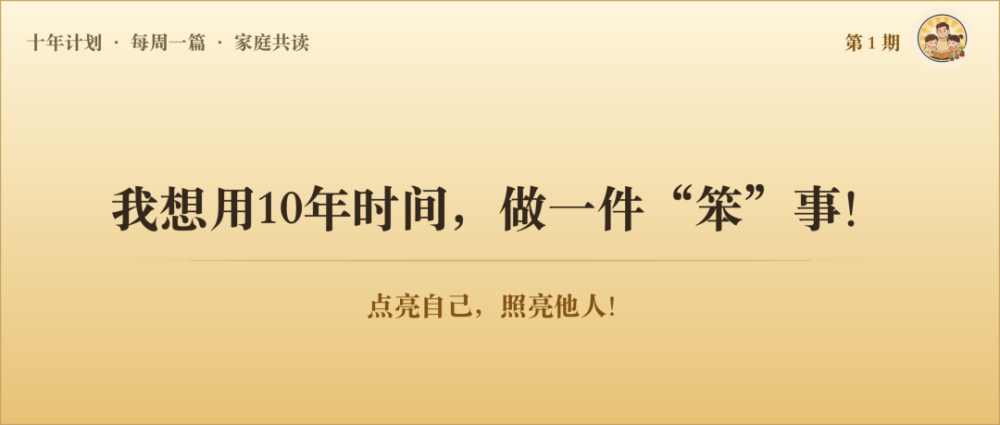
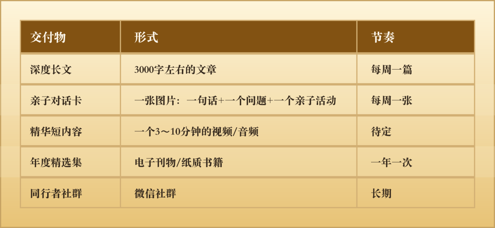
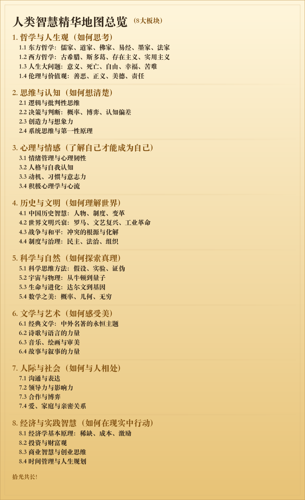
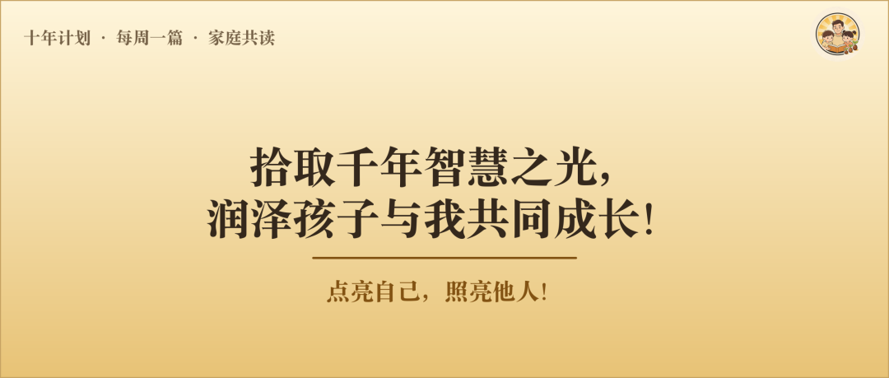

# 我想用10年时间，做一件“笨”事

前几天，一个朋友问我周末最近在忙什么。

我说："我想用10年时间，把人类几千年积累的智慧精华，一点一点消化，写成普通人能看懂的文章，大人读了有收获，还能讲给孩子听。"

他愣了一下，说："这事儿……能行吗？"

我说："不知道。但我想试试。"

---

## 一、一个念头的起点

这个念头不是突然冒出来的，它在我心里已经很久了。

起因很简单——我有了孩子之后，开始反复问自己一个问题：**除了让孩子吃饱穿暖、****为他尽力铺一条平稳的路****，我还能给他留下什么？**

房子会折旧，存款会贬值，知识会过时，但有一样东西，时间越久越值钱——**智慧**。

  

苏格拉底说“未经审视的人生不值得过”，这句话说了2400年，今天读来依然振聋发聩；老子说“大智若愚，大巧若拙”，穿越千年，依然是面对复杂世界最高明的生存哲学；王阳明提出“知行合一”，依旧是最高级的成事心法。亚当·斯密看透了经济运转的底层逻辑，费曼揭示了学习的本质，塔勒布阐述了“反脆弱”的生存智慧，查理·芒格总结出了终生受用的“多元思维模型”，阿德勒剖析了自卑与超越的心理密码，卡尔·萨根让我们看到了人类在宇宙中的微小与伟大——这些人类智慧的精华，穿越了百年千年，至今熠熠生辉。

我想把这些东西学明白，然后用最朴素的语言讲出来。讲给自己听，讲给孩子听，也讲给所有愿意听的人。

---

## 二、我是怎么思考这件事的？

### 从一个反问开始

我先问了自己一个问题：**在这个时代，什么样的内容是真正能够穿越周期有长期价值的？**

答案很明确——**经过时间验证的内容。**

打开手机，满屏都是"3天教你搞定xxx""这个风口千万别错过""AI又出新功能了"。这些内容有用吗？当然有用。但它们的保质期太短了。三天的热点、一年的课程、两年的技术……都会过时。

但《论语》不会过时，《沉思录》不会过时，"进化论"不会过时，"认知偏差"不会过时。**人类智慧的经典，保质期是千年级的。**

这是我选择这个方向的第一个原因：**做时间的朋友，做不会被时间淘汰的内容。**

### AI替代不了的事

第二个思考是关于AI。

如今的社会节奏已经被AI完全拉满。但我却觉得，越是这个时候，我们越需要做一些“慢”的事，一些需要时间沉淀、带有生命温度的事。**把枯燥、重复、讲究效率的工作交给AI，把剩下的时间留给真实的生活**。

AI可以帮你写一篇关于苏格拉底的介绍，可以帮你总结《思考，快与慢》的核心观点，甚至可以帮你生成一堂"批判性思维课"。但AI做不到的是什么？

**AI做不到花十年时间去读、去消化、去经历、去感悟，然后用一个真实的人的生命体验，把这些智慧重新讲一遍。**

我写苏格拉底的时候，不只是在转述一个知识点——我是真的被"未经审视的人生不值得过"这句话击中过，是真的在某个深夜反思自己有多少"未经审视的观点"。这种经过生命过滤的理解，是AI写不出来的。

这让我相信，这件事有不可替代的价值。

  

### 一个被忽视的场景

第三个思考是关于定位。

市面上已经有很多优秀的知识类内容了。樊登讲书，给大人听；凯叔讲故事，给孩子听；得到做知识服务，少年得到做青少年通识。都很好。

但我发现还有一个场景可能被忽视了——**大人懂的智慧，如何讲给孩子听。**

不是给孩子简化一个低幼版本，而是大人自己先真正学懂一个东西，在这个过程中自己成长了，然后自然而然地在晚饭桌上、散步路上、睡前故事里，把这些智慧传递给孩子。

这是**跨代际的智慧传递**。不是"教育孩子"，而是"和孩子一起成长"。

在这个切口上，我理解还是有巨大需求的。

---

## 三、我为什么要做这件事？

我之所以想做这个事情，有三层原因。

### 第一层：为了自己

我想成为一个更有智慧的人。不是知道更多知识，而是面对人生的大问题时，能想得更清楚、看得更通透。

每周认真研读一个人类智慧的主题，10年下来就是520个主题，至少500本经典的核心内容。这件事做完，不管有没有人看，**我自己就已经值回票价了**。

这是一个"下限极高"的项目——即使最坏情况，我损失的只是时间和精力，获得的却是一整套经过系统梳理的人类智慧，以及一个被这些智慧滋养过的自己。

  

### 第二层：为了孩子

我希望有一天，孩子问我"爸爸，什么是勇气？""为什么要积极乐观？""经济学到底是怎么回事？"的时候，我不是敷衍地说"你长大就懂了"，而是能够从苏格拉底讲到王阳明，从达尔文讲到查理·芒格，用故事和智慧，陪他一起找到属于自己的答案。

我尽我最大可能，在今后写的每一篇文章最后，都附带一个"亲子对话指南"——用什么方式可以让孩子更容易理解？可以和孩子做什么小活动？可以讨论什么问题？

**智慧不应该只存在于书架上，它应该活在家庭的对话里。**

### 第三层：为了更多人

我相信，在这个焦虑的时代，有很多人和我一样，不满足于刷手机度日，想给自己和孩子一些真正有营养的精神食粮，但不知道从哪里开始，也没有时间把那些经典一本本啃完。

我愿意做那个"探路者"：我去啃那些经典，提炼精华，消化理解，然后用最通俗的语言分享给你。

---

## 四、我能给你带来什么？

如果你关注了我，我希望能给你带来这些：

**1. 每周一次"精神充电"**

在碎片化信息的洪流中，每周有一篇认真写的、有深度的长文等着你。不追热点，不贩卖焦虑，只是安安静静地和你聊一个人类思考了几千年的好话题。

**2. 一套"亲子对话素材"**

不知道晚饭时和孩子聊什么？亲子卡片直接拿去用。一个问题、一个故事、一个小活动——15分钟的高质量亲子时光。

**3. 替你省下数百小时的阅读时间**

每一期背后是我对多本经典的研读和提炼。你花10分钟阅读一篇文章，获得的是我花数小时消化并整理的精华。10年下来，相当于有人帮你把几百多本人类智慧经典的核心要点梳理了一遍。

**4. 一个"慢慢变聪明"的陪伴**

不是一夜暴富的秘籍，不是三天速成的技巧。是每周进步一点点，一年后回头看，发现自己思考问题的方式变了，看世界的角度宽了，和孩子的对话深了。

**5. 一个同行者的社群**

未来根据发展情况，我会考虑建立微信群和社群，让有同样想法的朋友们一起交流，分享亲子对话的故事，互相激励坚持学习。一个人走得快，一群人走得远。

  

我将尝试逐步给大家提供以下内容：

  

内容范围计划包括以下8个板块：

---

  

## 五、我的终极愿景 ##

### 一句话说清楚：

**我准备用十年时间，把人类数千年的智慧结晶，打磨成每个家庭都能读懂、用得上的“思想工具”，留下一套能够穿越周期、可以代际传递的精神作品。**

不追热点，不贩卖焦虑，我只写一种内容：**过了5年、10年、100年还值得读的东西。**

我希望留下一套作品——不是快消品，而是种子。十年后，即使我不再写了，这500多篇文章依然可以被一个陌生人从第1篇读起，依然觉得有价值有收获。

  

### 终极画面：

多年以后，我们的孩子长大后回忆起童年，他们也许不记得考了多少分、上了什么辅导班，但他们也许会记得——小时候，爸爸每个周末陪我写作业的时候，他也在认真写东西。曾经在晚饭桌上讲过苏格拉底的故事，在散步时聊过罗马帝国是怎么衰亡的，**这个世界到底是如何运转的**，在睡前探讨过“什么是真正的勇气”。  
这些对话，会像种子一样，种在他的心里，**未来无论面对怎样的人生风雨，都能保持独立思考的能力，从容地做出属于自己的选择。**

**如果真的有那么一天，这件事就是值得的**。

---

## 六、为什么是现在？为什么是我？

**为什么是现在？**  

当前这个时代，信息在爆炸性增长，知识随手可得，然而智慧却成了真正的稀缺品。屏幕可以填满孩子的童年，却代替不了晚饭桌上带有温度的亲子对话。时代节奏越快，我们越需要用人类千年的智慧，来做心里的锚。

  

**为什么是我？**  

坦白说，我不是最有资格做这件事的人。我不是哲学教授，不是心理学博士，不是教育专家。但也许正因为如此，我能用"一个普通人的视角"去理解和转述这些智慧。

我不是"来教你"，而是"我也在学，我把学到的最好的东西分享给你。"

---

## 七、一个邀请

如果你读到这里，觉得这件事有那么一点打动你——

也许你也是一个想给孩子更多精神滋养的父母；  
也许你自己就渴望在忙碌的日子里保持思考和成长；  
也许你只是好奇，想看看一个普通人认真做一件事，到底能做出什么来。

**欢迎你关注我，成为这段旅程最早的同行者。**

我会通过公众号每周发布内容，后续也会建立一个微信群，让我们有一个可以交流的地方。在群里，你可以：

* 第一时间读到每周的新文章
* 获取亲子对话卡等实用素材
* 分享你和孩子的对话故事
* 和同频的朋友一起交流

---

## 写在最后

有人问我："这事儿能坚持十年吗？"

说实话，我也不知道。但我有想过——

就算写了十年没什么人看，我获得的是：读了数百本人类智慧经典，认真思考了人生最重要的问题，和孩子有了十年深度对话的素材，自己变成了一个远比今天更有智慧的人。

**最差的结果，也不过是我自己变成了一个更好的人。**

这笔账怎么算都不亏。

所以，我开始了。

  

*"种一棵树最好的时间是十年前，其次是现在！"*

下周开始，我们从2400年前雅典的一间法庭聊起。

**第1期：《一切始于提问——苏格拉底的追问》**

我要开始了。你要不要一起？

*如果你想加入，可以关注我的公众号或者加入我的微信。*  
*让我们一起，拾取人类千年智慧之光，润泽孩子与我们共同成长！*

        

