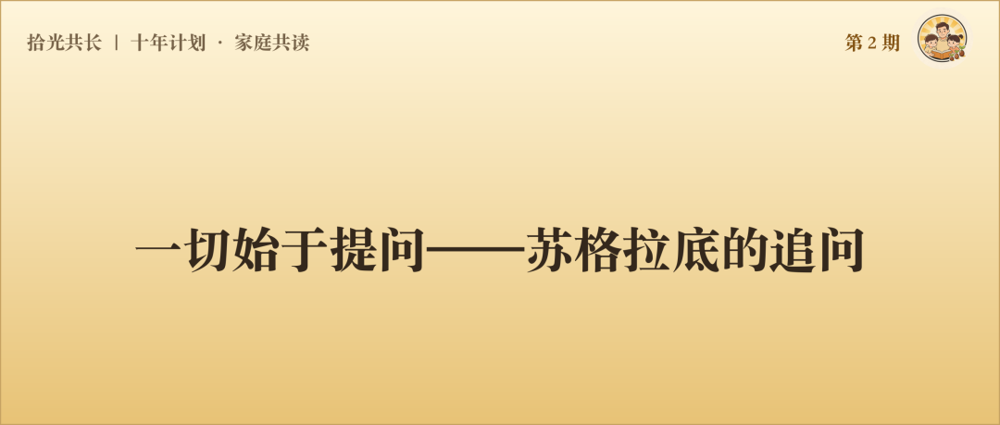
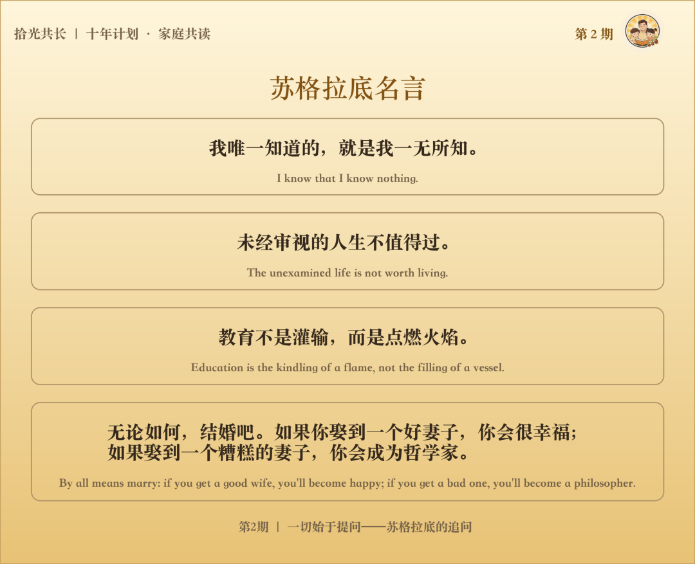
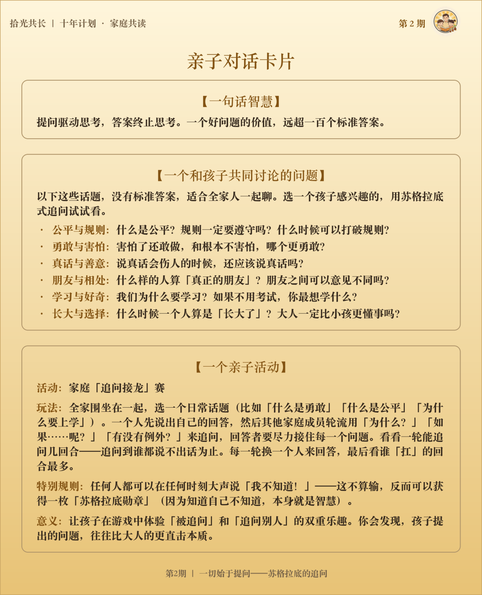

# 一切始于提问——苏格拉底的追问

2000多年前，雅典的集市上，阳光把石板路晒得发烫。

一位将军刚从战场凯旋，铠甲上还沾着尘土，人群自动让出一条路。他昂着头走过来，身上带着胜利者才有的那种笃定。

一个光着脚、穿着旧袍子的老人从人群中走出来，拦住了他。

"将军，我想请教您一个问题：什么是勇敢？"

将军几乎没有犹豫："勇敢就是面对危险，绝不退缩。"

老人点点头，像是接受了这个答案，却又不紧不慢地追了一句："如果一个士兵不知道前面有埋伏，稀里糊涂地往前冲，他也算勇敢吗？"

将军想了想："那不算。勇敢应该是明知道有危险，还敢往前冲。"

老人又问："如果一个士兵明知冲上去必死无疑，而且对战局毫无帮助，他还是往前冲——这叫勇敢，还是叫送死？"

将军的嘴张了张，没有出声。

围观的人越聚越多。老人的语气始终温和，但每一个问题都像一把小刀，一层一层削掉将军话语里那些模糊的、经不起推敲的部分。

将军的额头渗出了汗。他一生征战沙场，对千军万马面不改色。但此刻他发现——**"勇敢"这个他喊了一辈子、用来训话士兵的词，自己从来没有真正想清楚过。**

这样的场景，在雅典的街头重复了四十年。这个老人问将军什么是勇敢，问法官什么是正义，问智者什么是智慧，问所有人什么是幸福。他不争吵，不说教，只是一个接一个地提问——然后那些最自信的人，就一个接一个地沉默了。

年轻人开始围在他身边，学着他的方式去追问一切。

  

公元前399年，雅典——这座以"民主"闻名于世的城市——判处了这个老人死刑。

他的罪名不是杀人，不是叛国，不是盗窃。而是因为他问了太多问题。权威开始动摇，"真理"开始松动，"神灵"开始被质疑。这让统治者们感到恐惧。最终给他定下的两条罪名是：**不敬神明，腐蚀青年。**  

他们决定用一杯毒酒，永远封住这张嘴。

朋友买通了狱卒安排好了越狱，他拒绝了。他说：**我一辈子都在追问什么是正义，如果现在逃跑，那我问过的所有问题就都成了笑话。**

他端起毒酒，一饮而尽。

这个人叫苏格拉底。他死了，但他的问题活了2400年——至今仍在叩问每一个"以为自己已经想清楚了"的人。

---

## 一、苏格拉底式追问

苏格拉底每天做的事情很简单：在雅典的集市上、街巷里，和各种各样的人聊天。

但他聊天的方式非常特别——**他从不直接告诉你答案，他只是不停地问你问题。**

有一天，苏格拉底问一个学生："人人都说要做一个有道德的人，那道德究竟是什么？"

学生脱口而出："不说谎、不欺骗、忠诚老实，就是道德啊。"

苏格拉底没有反驳，只是追问了一句："打仗的时候，我军将领千方百计地欺骗敌人，诱敌深入、声东击西——这算不道德吗？"

学生愣了一下，赶紧修正："欺骗敌人当然可以。我的意思是，欺骗自己人才是不道德的。"

苏格拉底点点头，又问："假设我军被敌人重重包围，士兵们已经绝望了。这时候将领告诉大家'援军马上就到'——其实根本没有援军。但士兵们因此士气大振，奋力突围，最后全都活了下来。将领骗的是自己人，按你的说法，这不道德吗？"

学生沉默了一会儿，说："……那是战场上没办法。日常生活中骗人，总归不道德吧。"

苏格拉底笑了笑："你的儿子生病了，死活不肯吃药。你骗他说'这不是药，是一种很好吃的东西'，他吃了，病好了。你骗了自己最亲的人——这也不道德吗？"

学生彻底说不出话了。

  

**他发现，"道德"这个他从小挂在嘴边、觉得再清楚不过的词，自己其实从来没有真正想明白过。**

你看，苏格拉底从头到尾没有告诉学生"道德是什么"。他只是一个接一个地提问，让学生自己去发现、去感悟、去寻找属于他的答案！

  

这就是后来哲学史上最著名的方法论之一：**"苏格拉底式追问"**，也叫"助产术"。

为什么叫助产术？因为苏格拉底的母亲就是一个接生婆。他说：

"我的母亲帮助女人生孩子，而我帮助人的头脑生出真理。我自己并不生产智慧，我只是帮助别人把他们内心已有的智慧'接生'出来。"

这个比喻太精妙了。他不是在"灌输"什么，他是在用提问，**帮你自己想清楚**。

  

试想一下：如果苏格拉底像普通老师一样，直接告诉学生"道德就是xxx"，学生会怎样？经过这四轮追问，学生虽然没有得到一个"标准答案"，却经历了一场真正的思考——他的认知被打碎了，又在重建。

这背后有一个深刻的道理：

**提问驱动思考，答案终止思考。**

---

## 二、问题质量决定思考质量

两千多年后，爱因斯坦说了一句话："提出一个问题，往往比解决一个问题更重要。"

解决问题也许只需要技巧，而提出新问题，需要创造性的想象力。

**问题是思维的方向盘。** 你问什么，决定了你往哪里想。一个好的问题，能打开一扇门；而一个坏的问题，会把门关死。

  

孩子考砸了。

你问"是不是又没认真听课？"——思维的方向是：追责、定性、关门。孩子能做的只有辩解或沉默。

你如果问"这次哪些题你觉得挺难的？当时你是怎么想的？"——思维的方向是：还原现场、理解过程、开门。孩子开始复盘、分析、重新思考。

**同一件事，两个问题，通向完全不同的世界。**

问题本身的质量，决定了对话的质量。对话的质量，决定了思考的质量。苏格拉底其实一直在做的，就是这件事——**用高质量的问题，撬动高质量的思考。**

牛顿问"苹果为什么往下掉"，达尔文问"物种为什么如此多样"，爱因斯坦问"如果我骑在一束光上，会看到什么"——每一次改变人类历史进程的发现，都始于一个好问题。

好的答案解决一个问题，**好的问题打开一个世界。**

---

## 三、我们是怎么失去"提问的能力"的？

**孩子天生就是苏格拉底。**

每一个3~7岁的孩子，都是一台不知疲倦的"提问机器"——

"天空为什么是蓝色的？"  
"为什么人会死？"  
"我是从哪里来的？"  
"为什么那个叔叔不开心？"  
"如果把整个海都冻起来，鱼会怎么样？"

这些问题里，有些是科学问题，有些是哲学问题，有些连大人都回答不了。孩子不是在"故意刁难"你，他们是在用问题去探索这个陌生的世界。**提问是人类认知世界最原始、最本能、最强大的方式。**

但后来呢？

上了学，"答案"变得比"问题"重要。考试只考答案，不考问题。慢慢地，孩子学会了：提问是危险的（会显得你笨），知道答案才是安全的（老师会表扬你）。

我见过许多孩子，小时候灵气十足，眼眸明亮有神，小嘴叽叽喳喳说个不停。可随着慢慢长大，眼里的光渐渐黯淡，话也越来越少了。

那个曾经追着你问"为什么"的孩子，变成了一个不再提问的大人。

他不是不好奇了——他是**不敢问了，不想问了，甚至已经不会问了**。

苏格拉底用一生告诉我们：**提问不是无知的标志，提问是智慧的开端。**

---

## 四、把追问转向我们自己

写到这里，我想做一件苏格拉底会做的事情——把这个追问转向我们自己。

作为家长，我们每天和孩子说无数句话。但我们可以问问自己：

**我们说的话里，有多少是在给"答案"，有多少是在提"问题"？**

"别磨蹭了，快写作业！"——这是一个答案（一个指令）。  
"你觉得今天晚上的时间怎么安排比较好？"——这是一个问题。

  

"妹妹小，你要让着她！"——这是一个答案。  
"如果你是妹妹，你希望哥哥怎么对你？"——这是一个问题。

  

"好好学习，是为了你好！"——这是一个答案。  

"你觉得我们为什么要学习呢？"——这是一个问题。

  

苏格拉底的智慧教给我们：**你不需要有所有的答案，你只需要学会问好的问题。**

好的问题，能让孩子自己思考——不是替你记住一个标准答案，而是自己把路想通。

好的问题，能让孩子感到：在这场对话里，自己拥有平等对话的权利——我的话，值得被认真听。

好的问题，能让孩子慢慢懂得：**"想清楚"比"答对了"更重要**——前者管一辈子，后者只管这一题。

  

而最重要的是：**当你开始用"提问"代替"命令"，你和孩子的关系会发生一个微妙而深刻的变化——从"我教你"变成"我们一起想"。**

这不正是苏格拉底在2400年前，在雅典街头做的事吗？

---

## 写在最后

我们这个时代，最不缺的是答案，最稀缺的是好问题。

找到一个好问题，你就会打开一个新世界。

苏格拉底留给世界的最大遗产，不是某个结论，而是一种姿态：**永远保持好奇，永远不停追问，永远愿意承认"我不知道"。**

如果我们的孩子，能从小学会这种姿态——他将拥有一种任何时代都不会过时的能力：**独立思考的能力。**

而这种能力，始于一个简单的习惯：开口问一个自己关心的、没有想明白的问题。

---

## 附：苏格拉底式亲子对话指南

孩子是天生的哲学家，他们的小脑袋里装满了"为什么"。但遗憾的是，我们常常用敷衍的、现成的答案，堵死了他们通向深层智慧的道路。

根据苏格拉底的智慧，家长可以学习做孩子"思想的助产士"——在日常生活中运用"苏格拉底式追问"，培养孩子深度思考的能力。

核心原则：**当孩子提出问题，或对某件事下定论时，忍住直接给答案的冲动。用问题回应问题，引导孩子自己得出结论。**

### 

### 【实战三步曲】：

**第一步：接纳并反弹（破除惯性思考）**

当孩子抛出问题时，不要立刻解答，而是将思考的球抛回给孩子。

* 孩子："妈妈/爸爸，为什么我们要遵守规则？"
* 普通回答："因为不守规则会被惩罚。"（直接给答案，对话终止）
* 苏格拉底式回答："这真是一个好问题！你觉得如果没有规则，会发生什么呢？"

**第二步：寻找反例与矛盾（引向深度思考）**

根据孩子的回答，提出极端情况或反例，让孩子发现自己原有想法的漏洞。

* 孩子："如果不守规则，世界就会乱套，很多人可能会受伤。"
* 苏格拉底式回答："听起来很有道理。但你想想，如果有一条规则是'遇到红灯绝对不能闯'，这时候一辆救护车上有一个生命垂危的病人，前面是红灯——救护车为了救人闯了红灯。你觉得它做错了吗？"
* 孩子（陷入思考）："嗯……好像没有做错，因为救人更重要。"

**第三步：重塑与升华（完成思想的分娩）**

在孩子意识到旧观念不全面后，引导他们总结出更深刻的、属于自己的理解。

* 苏格拉底式回答："你看，遵守规则是为了保护大家，但救护车闯红灯也是为了保护生命。那你现在觉得，比'死守规则'更重要的，是什么？"
* 孩子（恍然大悟）："是规则背后的目的！是为了保护人！"
* 苏格拉底式回答："你通过自己的思考，找到了属于你的答案。这比我直接告诉你厉害多了。"

  
### 【苏格拉底式提问的四个层次】

苏格拉底的提问，不是随机的刁难，而是有结构的引导。理解了这个结构，你可以把它用在和孩子的每一次对话里。

**第一层：澄清问题**  
"你说的……是什么意思？""你能举个例子吗？"

很多时候，我们以为自己懂一个词，其实只是认识那几个字。"公平"是什么意思？"勇敢"是什么意思？"努力"是什么意思？当你让孩子举一个例子，他们往往会发现，那个词远没有自己以为的那么简单。

**第二层：追问假设**  
"你为什么这样认为？""如果不是这样，会怎样？"

每一个观点背后，都有一个假设。把假设挖出来，才能看清一个想法真正站得住脚的地方，以及它的漏洞所在。

**第三层：引入反例**  
"有没有一种情况，你的想法不成立？"

这不是要否定孩子，而是帮他把思维变得更严密。世界上没有放之四海而皆准的道理，所有规律都有边界。知道边界在哪里，才算真正理解。

**第四层：回到核心**  
"所以，你现在的想法是什么？"

兜兜转转之后，问题回到孩子自己身上。这个答案是他自己思考的结果，不是你给的。它会比你给的任何答案，都更牢固，更有生命力。

  

### 【给家长的三个锦囊】

**1. 容忍"不知道"**

当你的追问让孩子说出"我不知道"时，不要批评，要恭喜他。告诉他："太棒了，'知道自己不知道'，正是变聪明的第一步。"——苏格拉底的全部智慧，就始于这五个字。

**2. 避免质问的语气**

苏格拉底的追问是谦卑的探讨，不是居高临下的审讯。请多用"你觉得呢？""如果……会怎样？""有没有可能……"这样温和、好奇的句式。好的提问者，首先是好的倾听者。苏格拉底之所以有力量，不是因为他比别人聪明，而是因为他比别人更愿意听对方把话说完，然后才问下一个问题。

**3. 不怕没有标准答案**

有些追问（如什么是公平、什么是爱）没有最终答案。亲子之间共同探讨、享受抽丝剥茧的过程，本身就是最好的智慧传承。

---

## （本期完）

